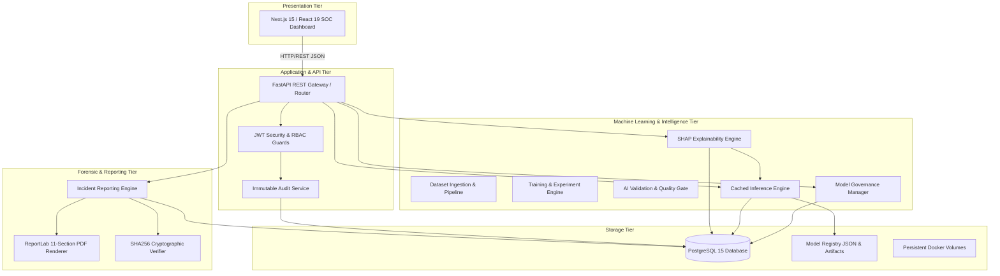

# SentinelX AI — Enterprise Cybersecurity Threat Simulation, Detection & Explainability Framework

[](docs/TESTING.md)
[](docs/TESTING.md)
[](LICENSE)
[](docs/DEPLOYMENT.md)
[](docs/API.md)
[](docs/DEPLOYMENT.md)
[](docs/DEPLOYMENT.md)

**SentinelX AI** is an enterprise-grade, autonomous cybersecurity threat simulation, AI-driven detection, model governance, explainability (XAI), and forensic investigation platform. It bridges offensive Red Team simulation with defensive Blue Team telemetry triage using machine learning models (Random Forest, XGBoost), deterministic SHAP feature attribution, strict model lifecycle governance, and automated 11-section PDF investigation report generation.

---

## 🏛️ System Architecture



---

## ✨ Key Capabilities

1. **Red Team Attack Simulation**: Automated payload execution and telemetry injection for SQL Injection, DDoS, DoS, Port Scanning, Brute Force, and Bot activity.
2. **Blue Team SOC Triage**: Automated detection alert generation, severity triage, and incident lifecycle management (`OPEN` → `INVESTIGATING` → `RESOLVED` → `CLOSED`).
3. **ML Inference Engine**: High-throughput prediction engine supporting Random Forest and XGBoost with memory caching for sub-10ms response times.
4. **Model Governance**: Strict 6-state lifecycle management (`TRAINING`, `VALIDATED`, `STAGING`, `PRODUCTION`, `ARCHIVED`, `FAILED`), single production model invariant, automated Model Cards, and transactional promotions/rollbacks.
5. **Explainable AI (SHAP)**: Feature attribution using `shap.TreeExplainer` and a robust shape normaliser, enforcing 5 structural validation rules.
6. **Enterprise Reporting Engine**: Automated 11-section PDF report generation featuring ReportLab dynamic page numbering (`Page X of Y`), audit log timeline building, MITRE ATT&CK technique mapping (`T1190`, `T1498`, etc.), deterministic remediation steps, and SHA256 cryptographic tamper verification.
7. **Production Containerization**: Multi-stage Dockerized deployment stack (`postgres`, `backend`, `frontend`) running non-root security accounts with healthcheck-conditioned startup dependency ordering.

---

## 🛠️ Technology Stack

| Layer | Technologies |
| :--- | :--- |
| **Frontend** | Next.js 15 (App Router, Standalone), React 19, TypeScript, Tailwind CSS, Lucide Icons, Framer Motion |
| **Backend API** | Python 3.11, FastAPI, Pydantic v2, Uvicorn ASGI Server |
| **Database & ORM** | PostgreSQL 15, SQLAlchemy 2.0 ORM, Alembic Migrations |
| **Machine Learning** | Scikit-Learn, XGBoost, LightGBM, Pandas, NumPy |
| **Explainable AI** | SHAP (`TreeExplainer`) |
| **Forensic PDF** | ReportLab PDF Toolkit, Hashlib (SHA256) |
| **Authentication** | JWT (`HS256`), Passlib (Bcrypt) |
| **Containerization** | Docker, Docker Compose, Alpine Linux, Python Slim |

---

## 🚀 Quick Start Guide

### Option A: Docker Compose (Recommended)

1. **Clone Repository & Set Environment**:
   ```bash
   git clone https://github.com/chetanbk/Red-team-vs-Blue-team.git
   cd Red-team-vs-Blue-team
   cp .env.example .env
   ```

2. **Launch Container Stack**:
   ```bash
   docker compose up -d
   ```
   - **Frontend SOC Dashboard**: `http://localhost:3000`
   - **Backend API Documentation**: `http://localhost:8000/docs`
   - **Healthcheck Endpoint**: `http://localhost:8000/health`

3. **Stop Stack**:
   ```bash
   docker compose down
   ```

---

### Option B: Local Python & Node Setup

1. **Backend Setup**:
   ```bash
   cd backend
   python3 -m venv .venv
   source .venv/bin/activate
   pip install -r requirements.txt
   JWT_SECRET="supersecretkey1234567890" DATABASE_URL="sqlite:///:memory:" uvicorn app.main:app --reload
   ```

2. **Frontend Setup**:
   ```bash
   cd frontend
   npm install
   npm run dev
   ```

---

## 📂 Project Structure

```
.
├── backend/                  # FastAPI Python Application
│   ├── app/
│   │   ├── api/              # REST API Router Handlers (Auth, Attacks, XAI, Reports)
│   │   ├── core/             # Security, JWT, Configuration Settings
│   │   ├── database/         # SQLAlchemy Session & Base Mixins
│   │   ├── ml_engine/        # Pipelines, Governance, Inference & SHAP Engine
│   │   ├── models/           # SQLAlchemy Database Models (10 Entities)
│   │   ├── reporting/        # Enterprise Incident PDF Reporting Engine
│   │   └── services/         # Business Logic Services & Audit Trail
│   ├── migrations/           # Alembic Database Migration Scripts
│   ├── tests/                # 78 Pytest Verification Tests
│   ├── Dockerfile            # Production Python Slim Dockerfile
│   └── entrypoint.sh         # Startup Migrations & Uvicorn Entrypoint
├── frontend/                 # Next.js 15 TypeScript Application
│   ├── src/
│   │   ├── app/              # Next.js App Router Pages & Layouts
│   │   └── components/       # SOC Views (Red Team, Blue Team, XAI, Reports)
│   ├── Dockerfile            # Multi-stage Alpine Dockerfile
│   └── next.config.js        # Standalone Build Configuration
├── docs/                     # Comprehensive Subsystem Documentation
│   ├── ARCHITECTURE.md       # Multi-tier System Architecture Specification
│   ├── DATABASE.md           # ERD & Complete Database Entity Reference
│   ├── API.md                # REST API Reference & Request/Response Schemas
│   ├── ML_PIPELINE.md        # Data Pipeline, Preprocessing & Training Engine
│   ├── MODEL_GOVERNANCE.md   # Lifecycle State Machine & Promotion Policy
│   ├── EXPLAINABILITY.md     # SHAP XAI Engine & Validation Rules
│   ├── REPORTING_ENGINE.md   # 11-Section PDF Renderer & SHA256 Verification
│   ├── DEPLOYMENT.md         # Docker Compose Container Infrastructure
│   ├── SECURITY.md           # Security Architecture, JWT & RBAC Matrix
│   └── TESTING.md            # Pytest Suite Architecture (78/78 Passed)
├── docker-compose.yml        # Docker Compose Stack Definition
├── CONTRIBUTING.md           # Open-Source Contribution Guidelines
├── CHANGELOG.md              # Milestone Version History (v0.1.0 to v0.8.0)
└── LICENSE                   # MIT License
```

---

## 📚 Technical Documentation Suite

Explore the detailed technical documentation suite in [`/docs`](docs/):

- 📐 [**Architecture Specification**](docs/ARCHITECTURE.md) — Subsystem breakdown, component interactions, data flow.
- 🗄️ [**Database Reference**](docs/DATABASE.md) — Entity Relationship Diagram (Mermaid), entity schemas, constraints.
- 🔌 [**REST API Reference**](docs/API.md) — Endpoint specifications, request/response JSON schemas, auth rules.
- 🤖 [**Machine Learning Pipeline**](docs/ML_PIPELINE.md) — Data preprocessing, training, validation, inference caching.
- 🛡️ [**Model Governance**](docs/MODEL_GOVERNANCE.md) — Lifecycle state machine, single production model policy, rollbacks.
- 💡 [**Explainable AI (SHAP)**](docs/EXPLAINABILITY.md) — SHAP TreeExplainer, shape normaliser, structural validation rules.
- 📄 [**Incident Reporting Engine**](docs/REPORTING_ENGINE.md) — 11-section PDF renderer, MITRE ATT&CK mapping, SHA256 integrity.
- 🐳 [**Deployment Guide**](docs/DEPLOYMENT.md) — Docker Compose architecture, healthchecks, volume persistence.
- 🔐 [**Security & RBAC Matrix**](docs/SECURITY.md) — JWT auth, role permissions matrix, audit trail logging.
- 🧪 [**Testing Strategy**](docs/TESTING.md) — Test suite breakdown, coverage metrics (78/78 tests passing).

---

## 🧪 Verification & Test Results

The platform includes an automated pytest suite covering unit, integration, governance, XAI, and reporting functionality:

```bash
cd backend
JWT_SECRET="testsecretkey12345678901234567890" DATABASE_URL="sqlite:///:memory:" ./.venv/bin/pytest tests/ -v
```

```
========================= 78 passed in 3.01s (100%) =========================
```

---

## 📄 License

This project is licensed under the MIT License — see the [LICENSE](LICENSE) file for details.

---

## 👨‍💻 Author & Maintainer

**SentinelX AI Core Architecture Team**  
*Lead Machine Learning & SOC Platform Architect:* Chetan B K  
*GitHub:* [github.com/chetanbk](https://github.com/chetanbk)
