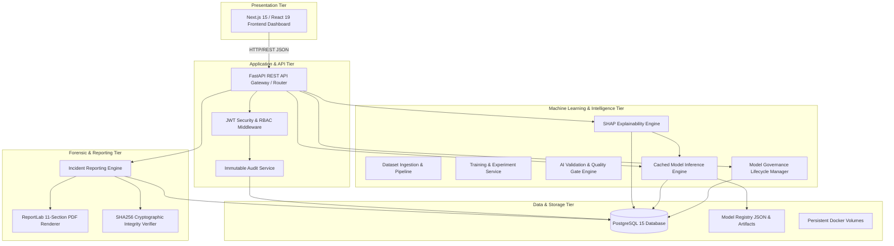
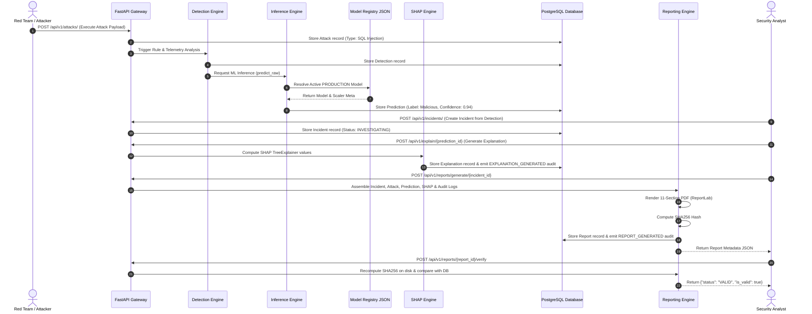

# SentinelX AI — Architecture Specification

## Executive Summary

SentinelX AI is an enterprise-grade, autonomous cybersecurity threat simulation, AI detection, model governance, explainability (XAI), and investigation reporting platform. It bridges the gap between offensive Red Team simulation and defensive Blue Team detection using machine learning models (Random Forest and XGBoost), deterministic SHAP feature attribution, strict model lifecycle governance, and automated forensic PDF report generation.

---

## 1. High-Level Multi-Tier Architecture

---

## 2. Subsystem Breakdown

### 2.1 Presentation Tier (Frontend Dashboard)
- **Framework**: Next.js 15 (App Router, Standalone Docker Output), React 19, TypeScript.
- **Styling**: Tailwind CSS, Framer Motion, Lucide React icons.
- **Modules**:
  - **Red Team Lab**: Interactive payload execution & attack orchestration.
  - **Blue Team SOC View**: Real-time detection alerts, incident management, and threat severity triage.
  - **ML Engine Studio**: Dataset uploads, model training experiments, and metric benchmarking.
  - **Explainability View**: SHAP force plots, feature attribution tables, and prediction breakdown.
  - **Reports & Forensics**: Incident PDF generation, streaming downloads, and SHA256 integrity verification.

### 2.2 Application & API Tier (Backend Gateway)
- **Framework**: Python 3.11, FastAPI, Pydantic v2, Uvicorn ASGI server.
- **Security & RBAC**: JWT Bearer token authentication, bcrypt password hashing, role-based route guards (`Admin`, `Security Analyst`, `Analyst`, `User`, `Guest`).
- **Audit System**: Centralized `AuditService` logging immutable action entries (`resource`, `resource_id`, `action`, `user_id`, `ip_address`, `status`, `details`).

### 2.3 Machine Learning Engine Tier
- **Dataset Pipeline (`DatasetPipeline`)**: CSV loading, validation, label encoding, scaling, and train/test splitting.
- **Training Pipeline (`TrainingService`)**: Supports Random Forest and XGBoost model training experiments with reproducible seeds.
- **Validation Engine (`ValidationService`)**: 5-fold cross-validation, `MetricsAnalyzer` (Accuracy, Precision, Recall, F1-Score), and `ThresholdEvaluator` quality gate policy checks.
- **Model Governance (`ModelGovernanceService`)**: Lifecycle state machine (`TRAINING` → `VALIDATED` → `STAGING` → `PRODUCTION` → `ARCHIVED` / `FAILED`), single production model invariant, automated model card generation, and transactional promotion/rollback.
- **Inference Engine (`InferenceService`)**: Resolves active production models via registry, manages class-level memory caches for estimator artifacts and scalers, validates incoming feature telemetry.

### 2.4 Explainability Tier (SHAP Framework)
- **Engine (`SHAPEngine`)**: Dispatches model to `shap.TreeExplainer`.
- **Shape Normaliser (`_extract_row_shap`)**: Standardises output across SHAP versions (1D, 2D, and 3D array shapes for multi-class and binary RF/XGBoost models).
- **Validation (`ExplanationValidator`)**: Enforces 5 structural integrity rules prior to database persistence.
- **Persistence (`ExplanationPersistence`)**: Append-only storage in `explanations` table with rounded 6-decimal-place SHAP float precision.

### 2.5 Forensic & Reporting Tier
- **Report Engine (`ReportService`)**: Ingests persisted entities (`Incident`, `Attack`, `Detection`, `Prediction`, `Explanation`, `Model`, `AuditLog`, `User`).
- **PDF Renderer (`PDFRenderer`)**: Generates an 11-section PDF using ReportLab with a dynamic `NumberedCanvas` header/footer (`Page X of Y`).
- **Integrity Verifier (`ReportIntegrityVerifier`)**: Computes 64-character SHA256 hex digests and verifies PDF files against stored database hashes.

---

## 3. End-to-End Security Sequence Data Flow

The sequence diagram below illustrates the end-to-end data flow from Red Team attack execution to Blue Team detection, AI inference, SHAP explanation, incident creation, and PDF report generation:

---

## 4. Communication & Storage Isolation

1. **Network Boundary**: All application components communicate within a Docker bridge network (`sentinel-network`). External access is limited strictly to HTTP ports `3000` (Frontend) and `8000` (Backend API).
2. **Database Boundary**: PostgreSQL 15 stores all relational entities. Connection strings are injected strictly via environment variables (`DATABASE_URL`).
3. **Artifact Boundary**: Machine learning models, dataset CSVs, and generated PDF reports are persisted in isolated Docker volumes (`models`, `datasets`, `reports`, `logs`).
