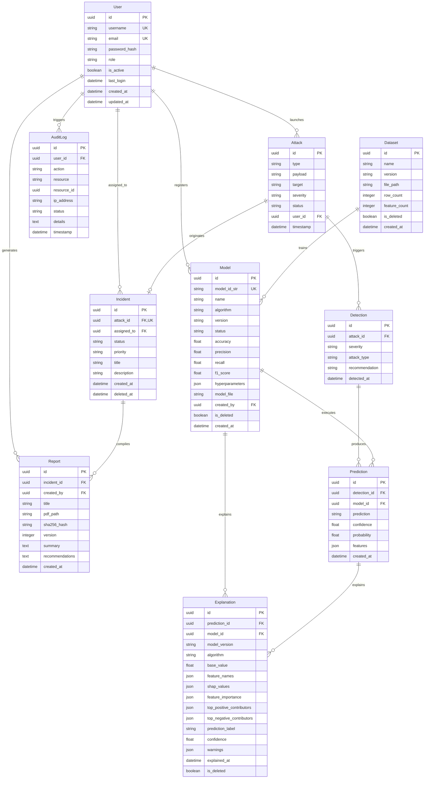

# SentinelX AI — Database Architecture & Schema Reference

## Overview

SentinelX AI uses **PostgreSQL 15** as its primary relational datastore, managed via **SQLAlchemy 2.0 ORM** and **Alembic** database migrations. The database design strictly adheres to third normal form (3NF), enforcing foreign key integrity constraints, UUID primary keys, automated timestamp tracking, soft-delete mechanisms, and immutable audit logs.

---

## 1. Entity Relationship Diagram (ERD)

---

## 2. Table Specifications

### 2.1 `users` Table
Stores platform user accounts, security roles, and authentication state.

| Column | Type | Constraints | Description |
| :--- | :--- | :--- | :--- |
| `id` | `UUID` | Primary Key, Default `uuid4()` | Unique user identifier |
| `username` | `VARCHAR(64)` | Unique, Not Null, Index | Unique login handle |
| `email` | `VARCHAR(320)` | Unique, Not Null, Index | User email address |
| `password_hash` | `VARCHAR(255)` | Not Null | Bcrypt hashed password |
| `role` | `VARCHAR(32)` | Not Null, Default `'user'` | Role (`admin`, `security_analyst`, `user`, `guest`) |
| `is_active` | `BOOLEAN` | Not Null, Default `TRUE` | Account status flag |
| `last_login` | `TIMESTAMP` | Nullable | Last authentication timestamp |
| `created_at` | `TIMESTAMP` | Not Null, Server Default `now()` | Account creation time |
| `updated_at` | `TIMESTAMP` | Not Null, Server Default `now()` | Account modification time |

---

### 2.2 `datasets` Table
Tracks ingested benchmark training and validation datasets.

| Column | Type | Constraints | Description |
| :--- | :--- | :--- | :--- |
| `id` | `UUID` | Primary Key, Default `uuid4()` | Unique dataset identifier |
| `name` | `VARCHAR(128)` | Not Null | Dataset name (e.g. `cicids_test`) |
| `version` | `VARCHAR(64)` | Not Null | Dataset version tag (e.g. `v1.0`) |
| `file_path` | `VARCHAR(512)` | Nullable | Path to raw/preprocessed CSV file |
| `row_count` | `INTEGER` | Nullable | Number of sample rows |
| `feature_count` | `INTEGER` | Nullable | Number of telemetry feature columns |
| `is_deleted` | `BOOLEAN` | Not Null, Default `FALSE` | Soft-delete flag |
| `created_at` | `TIMESTAMP` | Not Null, Server Default `now()` | Dataset registration time |

---

### 2.3 `models` Table
Stores machine learning model governance metadata, performance metrics, and artifact paths.

| Column | Type | Constraints | Description |
| :--- | :--- | :--- | :--- |
| `id` | `UUID` | Primary Key, Default `uuid4()` | Database model primary key |
| `model_id_str` | `VARCHAR(128)` | Unique, Nullable | String UUID alias matching `registry.json` |
| `name` | `VARCHAR(128)` | Not Null | Display model name |
| `algorithm` | `VARCHAR(64)` | Not Null | Algorithm (`random_forest`, `xgboost`) |
| `version` | `VARCHAR(64)` | Not Null | Model semantic version string (e.g. `1.0.0`) |
| `status` | `VARCHAR(32)` | Not Null, Default `'VALIDATED'` | Governance status (`TRAINING`, `VALIDATED`, `STAGING`, `PRODUCTION`, `ARCHIVED`, `FAILED`) |
| `accuracy` | `FLOAT` | Not Null, Default `0.0` | Validation accuracy score `[0.0, 1.0]` |
| `precision` | `FLOAT` | Not Null, Default `0.0` | Validation precision score `[0.0, 1.0]` |
| `recall` | `FLOAT` | Not Null, Default `0.0` | Validation recall score `[0.0, 1.0]` |
| `f1_score` | `FLOAT` | Not Null, Default `0.0` | Validation F1 score `[0.0, 1.0]` |
| `hyperparameters` | `JSON` | Nullable | Serialized training hyperparameter dict |
| `model_file` | `VARCHAR(512)` | Nullable | Disk path to saved `.pkl` model binary |
| `created_by` | `UUID` | FK → `users.id` (SET NULL) | Creator user ID |
| `is_deleted` | `BOOLEAN` | Not Null, Default `FALSE` | Soft-delete flag |
| `created_at` | `TIMESTAMP` | Not Null, Server Default `now()` | Model training timestamp |

---

### 2.4 `attacks` Table
Records Red Team attack simulation executions and incoming threat payloads.

| Column | Type | Constraints | Description |
| :--- | :--- | :--- | :--- |
| `id` | `UUID` | Primary Key, Default `uuid4()` | Unique attack ID |
| `type` | `VARCHAR(128)` | Not Null | Attack category (e.g. `SQL Injection`, `DDoS`) |
| `payload` | `TEXT` | Nullable | Raw attack string or telemetry payload |
| `target` | `VARCHAR(128)` | Not Null | Targeted host or service |
| `severity` | `VARCHAR(32)` | Enum `Severity` | Threat severity (`LOW`, `MEDIUM`, `HIGH`, `CRITICAL`) |
| `status` | `VARCHAR(32)` | Enum `AttackStatus` | Execution status (`PENDING`, `RUNNING`, `COMPLETED`, `FAILED`) |
| `user_id` | `UUID` | FK → `users.id` (SET NULL) | Initiating user ID |
| `timestamp` | `TIMESTAMP` | Not Null, Server Default `now()` | Execution timestamp |

---

### 2.5 `detections` Table
Records automated rule-based and telemetry detection triggers raised by attack executions.

| Column | Type | Constraints | Description |
| :--- | :--- | :--- | :--- |
| `id` | `UUID` | Primary Key, Default `uuid4()` | Unique detection ID |
| `attack_id` | `UUID` | FK → `attacks.id` (RESTRICT), Not Null | Originating attack ID |
| `severity` | `VARCHAR(32)` | Enum `Severity`, Not Null | Flagged threat severity |
| `attack_type` | `VARCHAR(128)` | Not Null | Classified attack category |
| `recommendation` | `TEXT` | Nullable | Initial automated mitigation hint |
| `detected_at` | `TIMESTAMP` | Not Null, Server Default `now()` | Detection trigger timestamp |

---

### 2.6 `predictions` Table
Stores machine learning inference results evaluated against detection feature vectors.

| Column | Type | Constraints | Description |
| :--- | :--- | :--- | :--- |
| `id` | `UUID` | Primary Key, Default `uuid4()` | Unique prediction ID |
| `detection_id` | `UUID` | FK → `detections.id` (RESTRICT), Not Null | Associated detection ID |
| `model_id` | `UUID` | FK → `models.id` (RESTRICT), Nullable | Executing model ID |
| `prediction` | `VARCHAR(64)` | Not Null | Predicted label (`malicious`, `clean`) |
| `confidence` | `FLOAT` | Not Null | Inference confidence score `[0.0, 1.0]` |
| `probability` | `FLOAT` | Not Null | Malicious class probability `[0.0, 1.0]` |
| `features` | `JSON` | Nullable | Feature dictionary passed during inference |
| `created_at` | `TIMESTAMP` | Not Null, Server Default `now()` | Prediction creation timestamp |

---

### 2.7 `incidents` Table
Represents Blue Team security incidents created from validated attack detections.

| Column | Type | Constraints | Description |
| :--- | :--- | :--- | :--- |
| `id` | `UUID` | Primary Key, Default `uuid4()` | Unique incident ID |
| `attack_id` | `UUID` | FK → `attacks.id` (RESTRICT), Unique, Not Null | Linked attack ID |
| `assigned_to` | `UUID` | FK → `users.id` (SET NULL), Nullable | Assigned SOC analyst user ID |
| `status` | `VARCHAR(32)` | Enum `IncidentStatus`, Not Null | Lifecycle status (`OPEN`, `INVESTIGATING`, `RESOLVED`, `CLOSED`) |
| `priority` | `VARCHAR(32)` | Enum `Severity`, Not Null | Incident priority (`LOW`, `MEDIUM`, `HIGH`, `CRITICAL`) |
| `title` | `VARCHAR(256)` | Not Null | Incident title summary |
| `description` | `TEXT` | Nullable | Detailed incident narrative |
| `created_at` | `TIMESTAMP` | Not Null, Server Default `now()` | Incident open time |
| `deleted_at` | `TIMESTAMP` | Nullable | Incident closure / soft-delete timestamp |

---

### 2.8 `explanations` Table
Append-only store for SHAP feature attribution explanations.

| Column | Type | Constraints | Description |
| :--- | :--- | :--- | :--- |
| `id` | `UUID` | Primary Key, Default `uuid4()` | Unique explanation ID |
| `prediction_id` | `UUID` | FK → `predictions.id` (CASCADE), Not Null, Index | Originating prediction ID |
| `model_id` | `UUID` | FK → `models.id` (CASCADE), Not Null, Index | Explaining model ID |
| `model_version` | `VARCHAR(64)` | Nullable | Model version string |
| `algorithm` | `VARCHAR(128)` | Nullable | Algorithm name |
| `base_value` | `FLOAT` | Not Null | SHAP expected baseline value |
| `feature_names` | `JSON` | Not Null | Ordered list of feature names `[str]` |
| `shap_values` | `JSON` | Not Null | Ordered list of rounded SHAP floats `[float]` |
| `feature_importance` | `JSON` | Not Null | Sorted list `[{feature, shap_value, direction}]` |
| `top_positive_contributors` | `JSON` | Not Null | Top positive risk contributors |
| `top_negative_contributors` | `JSON` | Not Null | Top negative risk contributors |
| `prediction_label` | `VARCHAR(64)` | Nullable | Prediction label snapshot |
| `confidence` | `FLOAT` | Nullable | Prediction confidence snapshot |
| `warnings` | `JSON` | Not Null, Default `[]` | Non-fatal explanation warnings |
| `explained_at` | `TIMESTAMP` | Not Null, Server Default `now()` | Explanation calculation timestamp |
| `is_deleted` | `BOOLEAN` | Not Null, Default `FALSE` | Soft-delete flag |

---

### 2.9 `reports` Table
Stores enterprise PDF report metadata, disk file paths, and cryptographic SHA256 hashes.

| Column | Type | Constraints | Description |
| :--- | :--- | :--- | :--- |
| `id` | `UUID` | Primary Key, Default `uuid4()` | Unique report ID |
| `incident_id` | `UUID` | FK → `incidents.id` (RESTRICT), Not Null | Associated incident ID |
| `created_by` | `UUID` | FK → `users.id` (SET NULL), Nullable | Generating user ID |
| `title` | `VARCHAR(256)` | Nullable | Report display title |
| `pdf_path` | `VARCHAR(512)` | Nullable | Disk path to generated `.pdf` file |
| `sha256_hash` | `VARCHAR(64)` | Nullable | 64-character SHA256 hex digest |
| `version` | `INTEGER` | Not Null, Default `1` | Report schema version |
| `summary` | `TEXT` | Nullable | Report summary text (backwards compatible) |
| `recommendations` | `TEXT` | Nullable | File path property fallback |
| `created_at` | `TIMESTAMP` | Not Null, Server Default `now()` | Report generation timestamp |

---

### 2.10 `audit_logs` Table
Append-only, immutable audit trail recording all platform security and administrative actions.

| Column | Type | Constraints | Description |
| :--- | :--- | :--- | :--- |
| `id` | `UUID` | Primary Key, Default `uuid4()` | Unique audit log entry ID |
| `user_id` | `UUID` | FK → `users.id` (SET NULL), Nullable | Initiating user ID (`NULL` for system) |
| `action` | `VARCHAR(128)` | Not Null, Index | Action string (e.g. `REPORT_GENERATED`, `EXPLANATION_VALIDATED`) |
| `resource` | `VARCHAR(128)` | Not Null | Targeted entity type |
| `resource_id` | `UUID` | Nullable | Targeted entity UUID |
| `ip_address` | `VARCHAR(45)` | Not Null, Default `'127.0.0.1'` | Client IP address |
| `status` | `VARCHAR(32)` | Not Null, Default `'success'` | Action outcome (`success`, `failure`) |
| `details` | `TEXT` | Nullable | Detailed action log message |
| `timestamp` | `TIMESTAMP` | Not Null, Server Default `now()`, Index | Log creation timestamp |
