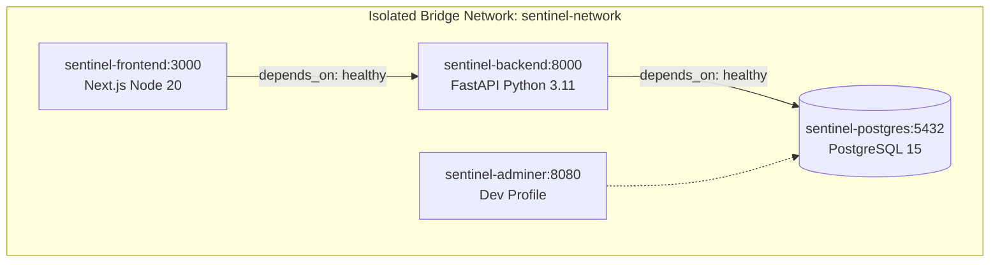

# SentinelX AI — Container Deployment Specification

## Overview

SentinelX AI is fully containerized using **Docker** and **Docker Compose**. Single-command deployment (`docker compose up -d`) orchestrates PostgreSQL 15, FastAPI backend, Next.js frontend, and optional dev tools with healthcheck-based dependency sequencing, volume persistence, and automatic database migrations.

---

## 1. Container Topology



---

## 2. Service Specifications

| Service | Container Name | Base Image / Build | Port | Non-Root User | Healthcheck Command |
| :--- | :--- | :--- | :--- | :--- | :--- |
| `postgres` | `sentinel-postgres` | `postgres:15-alpine` | `5432` | `postgres` | `pg_isready -U postgres -d sentinelx_db` |
| `backend` | `sentinel-backend` | `./backend/Dockerfile` | `8000` | `appuser` (10001) | `curl -f http://localhost:8000/health` |
| `frontend` | `sentinel-frontend` | `./frontend/Dockerfile` | `3000` | `nextjs` (1001) | `wget --spider http://localhost:3000/` |
| `adminer` *(dev)* | `sentinel-adminer` | `adminer:latest` | `8080` | `adminer` | N/A (Dev profile only) |

---

## 3. Automated Database Migrations (`entrypoint.sh`)

When `sentinel-backend` starts:
1. Verifies PostgreSQL health (`depends_on: condition: service_healthy`).
2. Creates runtime storage directories (`/app/models`, `/app/datasets`, `/app/reports`, `/app/logs`).
3. Executes `alembic upgrade head` to automatically apply outstanding database migrations.
4. Boots application server via `exec uvicorn app.main:app --host 0.0.0.0 --port 8000`.

---

## 4. Volume Persistence

Five named local Docker volumes persist state across container restarts:

- `postgres-data` → `/var/lib/postgresql/data` (Relational DB storage)
- `models` → `/app/models` (Model binaries, scalers, `registry.json`)
- `datasets` → `/app/datasets` (Preprocessed training CSVs)
- `reports` → `/app/reports` (Generated PDF investigation reports)
- `logs` → `/app/logs` (Application log files)

---

## 5. Deployment Commands (`README.md`)

```bash
# Copy default environment settings
cp .env.example .env

# Start complete platform
docker compose up -d

# Stop platform
docker compose down

# Rebuild and restart containers
docker compose up --build -d

# View live container logs
docker compose logs -f

# Start with Adminer DB GUI (Port 8080)
docker compose --profile dev up -d
```
