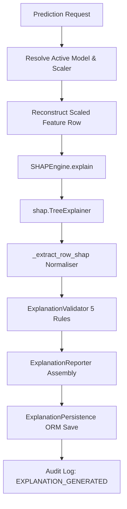

# SentinelX AI — Explainable AI (SHAP) Specification

## Overview

The Explainable AI (XAI) subsystem integrates **SHAP (SHapley Additive exPlanations)** to provide deterministic, feature-level attribution for predictions generated by the SentinelX AI inference engine. Explanations quantify the exact contribution of each telemetry feature toward increasing or decreasing malicious risk.

---

## 1. SHAP Architecture (`SHAPEngine`)

`SHAPEngine` uses `shap.TreeExplainer` for ensemble tree-based classifiers (Random Forest and XGBoost):

---

## 2. SHAP Output Shape Normalisation

SHAP `TreeExplainer` produces varying output array shapes depending on SHAP library version, model algorithm, and multi-class layout:

| SHAP Output Layout | Model Context | Extraction Logic in `_extract_row_shap` |
| :--- | :--- | :--- |
| `list[array]` | Binary RF (Old SHAP API) | `arr[1][0]` (Positive Class) |
| `(1, n_features, n_classes)` | Binary RF (Newer SHAP API) | `arr[0, :, -1]` (Positive Class) |
| `(n_classes, n_samples, n_features)` | Multi-class RF | `arr[-1, 0]` |
| `(1, n_features)` | XGBoost 2D | `arr[0]` |

The normalizer inspects array dimensions (`ndim`) and single-sample shapes at runtime to ensure forward and backward compatibility.

---

## 3. Structural Validation Rules (`ExplanationValidator`)

Before any explanation is persisted, `ExplanationValidator` enforces five structural rules:

- **Rule 1 (Prediction Existence)**: Originating `Prediction` row must exist in the database.
- **Rule 2 (Model Consistency)**: Explanation `model_id` must match `prediction.model_id`. Enforces actionable error hint if the active model changed post-prediction.
- **Rule 3 (Feature Count Alignment)**: Number of feature names must equal number of calculated SHAP values.
- **Rule 4 (Finite Float Array)**: SHAP value list must be a non-empty list of finite numeric floats (no `NaN` or `Inf`).
- **Rule 5 (Finite Base Value)**: SHAP expected `base_value` must be a finite numeric float.

---

## 4. DB Persistence & Audit Linkage

- **ORM Schema (`Explanation`)**: Append-only storage in `explanations` table.
- **Precision**: Raw floats validated; 6-decimal-place rounding applied at persistence boundary (`round(float(v), 6)`).
- **Audit Logs**: Emits `EXPLANATION_GENERATED` (with `resource_id=explanation.id`), `EXPLANATION_VALIDATED`, or `EXPLANATION_FAILED`.
