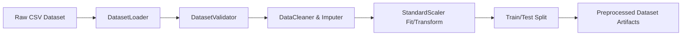

# SentinelX AI — Machine Learning Pipeline Specification

## Overview

The SentinelX AI machine learning pipeline provides deterministic, reproducible dataset pre-processing, training, validation, quality gate benchmarking, and real-time inference.

---

## 1. Dataset Pipeline (`DatasetPipeline`)

### 1.1 Responsibilities
- Validate raw CSV data format and required column existence.
- Handle missing or infinite values via Median Imputation.
- Encode categorical target labels (e.g. `BENIGN` → `0`, `Attack` → `1`).
- Fit and persist feature scaling transformers (`StandardScaler`).
- Perform reproducible train/test splits (default 80/20 ratio with fixed random seed `42`).

### 1.2 Processing Flow


---

## 2. Model Training Pipeline (`TrainingService`)

### 2.1 Supported Algorithms
1. **Random Forest Classifier (`random_forest`)**: `sklearn.ensemble.RandomForestClassifier`
2. **XGBoost Classifier (`xgboost`)**: `xgboost.XGBClassifier`

### 2.2 Training Workflow
- Accepts a hyperparameter experiment dictionary specifying algorithm, dataset name/version, and hyperparameters.
- Trains estimator on preprocessed training split.
- Evaluates validation metrics on test split (`Accuracy`, `Precision`, `Recall`, `F1-Score`).
- Persists model artifact (`.pkl`) to disk under `models/<model_id>/`.
- Creates and registers governance record in `models` database table and `registry.json`.

---

## 3. Validation & Quality Gate Engine (`ValidationService`)

### 3.1 5-Fold Cross Validation (`CrossValidator`)
Executes 5-fold Stratified K-Fold cross-validation across dataset splits to verify statistical stability and rule out overfitting.

### 3.2 Metrics Analyzer (`MetricsAnalyzer`)
Computes classification evaluation metrics:
$$\text{Accuracy} = \frac{TP + TN}{TP + TN + FP + FN}$$

$$\text{Precision} = \frac{TP}{TP + FP}$$

$$\text{Recall} = \frac{TP}{TP + FN}$$

$$\text{F1-Score} = 2 \cdot \frac{\text{Precision} \cdot \text{Recall}}{\text{Precision} + \text{Recall}}$$

### 3.3 Quality Gate Threshold Evaluator (`ThresholdEvaluator`)
Evaluates model candidate metrics against configurable policy thresholds prior to production promotion:
- Minimum Accuracy Guard: `0.85`
- Minimum F1-Score Guard: `0.80`

---

## 4. Inference Engine (`InferenceService`)

### 4.1 Class-Level Estimator & Scaler Caching
`InferenceService` uses class-level memory caches to avoid reloading model binary files from disk on every HTTP prediction request:

```python
class InferenceService:
    _cached_model_id: Optional[str] = None
    _cached_model: Any = None
    _cached_scaler: Any = None
    _cached_feature_names: List[str] = []
```

### 4.2 Prediction Sequence
1. Resolve active production model from registry (`_resolve_active_model()`).
2. Fetch model estimator and scaler instances from cache or load from disk (`_get_model_and_scaler()`).
3. Validate telemetry feature count and ordering against `expected_features`.
4. Apply scaler transformation: $X_{\text{scaled}} = \text{scaler.transform}(X_{\text{raw}})$.
5. Execute prediction: `model.predict(X_scaled)` & `model.predict_proba(X_scaled)`.
6. Record prediction in `predictions` database table.
