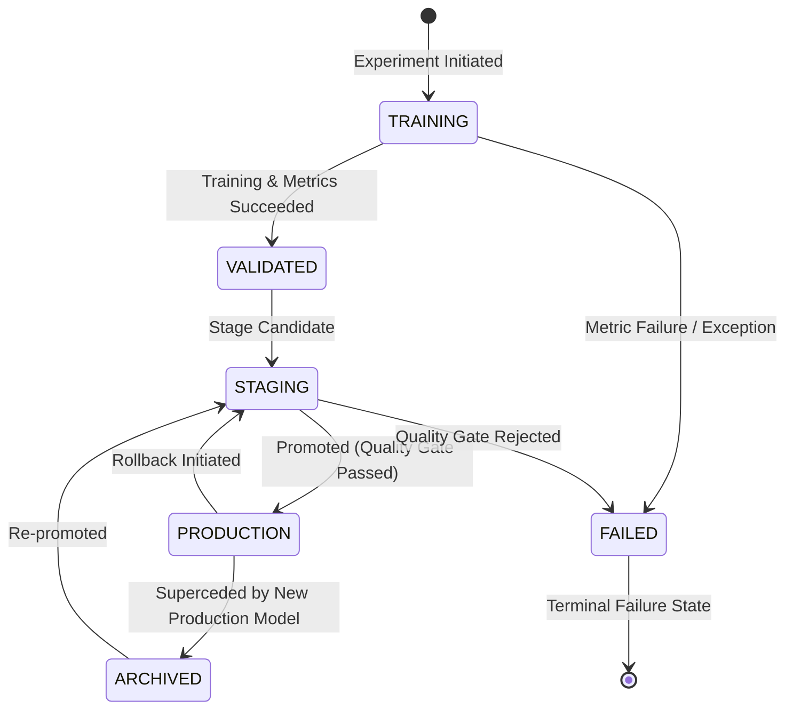

# SentinelX AI — Model Governance Specification

## Overview

The **Model Governance Service (`ModelGovernanceService`)** manages the formal lifecycle of all machine learning models in SentinelX AI. It enforces lifecycle state transitions, maintains the single active production model invariant, generates transparent model cards, handles transactional promotions and rollbacks, and executes startup integrity checks.

---

## 1. Governance Lifecycle State Machine

A model transitions through six explicit lifecycle states:

| Lifecycle State | Description | Allowed Operations |
| :--- | :--- | :--- |
| `TRAINING` | Model is currently being trained | None (Transient) |
| `VALIDATED` | Model passed initial validation evaluation | Stage, Archive |
| `STAGING` | Model candidate queued for production promotion | Promote, Archive |
| `PRODUCTION` | Active model serving live inference telemetry | Rollback, Archive |
| `ARCHIVED` | Former production model stored for audit history | Re-stage |
| `FAILED` | Terminal state for failed training or corrupt models | None (Read-only) |

---

## 2. Active Model Resolution Policy

> [!IMPORTANT]  
> **Single Production Model Invariant**  
> At any given point in time, exactly **one** model in the platform registry may be marked `PRODUCTION` (or `ACTIVE`).

When resolving the active model for inference or SHAP explainability:
1. Search registry for entry with `status == "PRODUCTION"`.
2. Fallback to entry with `status == "ACTIVE"`.
3. Fallback to last entry with `status == "READY"` (for legacy compatibility).
4. If no production model exists, raise `RuntimeError("No active production model found.")`.

---

## 3. Model Cards (`ModelCardGenerator`)

Every model registered generates a standardized Model Card containing:
- **Header**: Model ID, Name, Algorithm, Version, Creation Timestamp.
- **Provenance**: Dataset Name, Dataset Version, Preprocessing Version, Training Seed.
- **Metrics**: Accuracy, Precision, Recall, F1-Score, Cross-Validation F1.
- **Hyperparameters**: Detailed configuration parameters.
- **Status & Integrity**: Governance status, SHA256 checksums of model binary.

---

## 4. Transactional Promotion & Rollback

### 4.1 Promotion Flow
1. Verify target state is valid.
2. Evaluate model metrics against minimum promotion thresholds (`min_accuracy`, `min_f1`).
3. Commit database status change (`db.commit()`).
4. Update registry file on disk (`registry.json`). If database commit fails, registry file is not mutated.

### 4.2 Rollback Flow
1. Demote current `PRODUCTION` model to `STAGING` (or `ARCHIVED`).
2. Promote specified prior target model to `PRODUCTION`.
3. Atomically synchronize database state and disk registry.

---

## 5. Startup Validation Checks

During application startup (`@app.on_event("startup")`), `ModelGovernanceService.startup_validation()` runs diagnostics:
- Verifies registry file existence and JSON parsing.
- Verifies required metadata fields (`model_id`, `version`, `algorithm`, `status`).
- Validates model UUID strings.
- Detects corrupt entries and logs diagnostic warnings without crashing startup.
