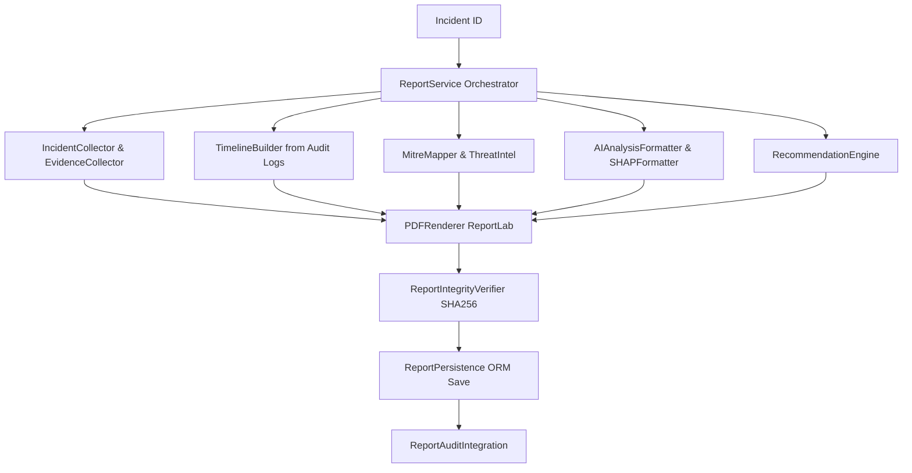

# SentinelX AI — Incident Reporting Engine Specification

## Overview

The **Enterprise Incident Reporting Engine (`ReportService`)** collects persisted data from across the security lifecycle (Incident, Attack, Detection, Prediction, SHAP Explanation, Model, Audit Logs, User) and compiles it into a professional 11-section investigation PDF report. Every report is cryptographically hashed (SHA256), persisted, and audited.

---

## 1. Reporting Architecture

---

## 2. 11-Section PDF Document Structure

1. **Cover Page**: Title, Incident ID, Report ID, Generated Time, Assigned Analyst, Classification banner, Status table.
2. **Executive Summary**: High-level narrative detailing attack type, target, prediction label, confidence, quality gate result, and status.
3. **Incident Details**: Incident UUID, Attack UUID, Opened/Closed timestamps, Priority, Severity, Target, Assigned User.
4. **Attack Analysis**: Attack Type, Source/Target, Timestamp, Severity, Status, and formatted code box displaying raw payload/indicators.
5. **AI Analysis & Model Provenance**: Algorithm, Version, Dataset Version, Pipeline Version, Prediction Label, Confidence, F1-Score, and Quality Gate result.
6. **Explainability & SHAP Contributions**: Base Value, Top Positive Contributors table, Top Negative Contributors table, and warning flags.
7. **Chronological Incident Timeline**: Tabular sequence of up to 15 chronological audit events (Timestamp, Action, Resource, Details).
8. **MITRE ATT&CK Mapping & Threat Intelligence**: Technique ID, Technique Name, Tactic, Description, and Standard Mitigation table.
9. **Evidence & Artifact References**: Prediction ID, Explanation ID, Model Artifact File, and Dataset References table.
10. **Deterministic Remediation Recommendations**: Category, Action Item, and Technical Details table.
11. **Appendix & Cryptographic Audit Metadata**: Platform Version, Report Engine Version, Generation Timestamp, and PDF Renderer metadata.

---

## 3. PDF Rendering & Dynamic Page Numbering

- **Engine**: ReportLab PDF Toolkit.
- **Canvas (`NumberedCanvas`)**: Implements a two-pass canvas saver (`showPage` / `save` override) that computes exact total page count dynamically.
- **Headers & Footers**:
  - Running Header: `SentinelX AI — Enterprise Incident Investigation Report` with line divider (omitted on cover page).
  - Running Footer: `CONFIDENTIAL — SentinelX AI Platform | {Timestamp}` and `Page X of Y` right-aligned (omitted on cover page).
- **Defensive Rendering**: `_p(text, style)` helper coerces `None` values to `"N/A"` or default fallback strings, preventing rendering crashes.

---

## 4. MITRE ATT&CK Technique Mapping

`MitreMapper` deterministically maps attack types to standard MITRE ATT&CK techniques without using LLMs:

| Attack Type | Technique ID | Technique Name | Tactic |
| :--- | :--- | :--- | :--- |
| SQL Injection | `T1190` | Exploit Public-Facing Application | Initial Access |
| DDoS | `T1498` | Network Denial of Service | Impact |
| DoS | `T1499` | Endpoint Denial of Service | Impact |
| Port Scan | `T1595` | Active Scanning | Reconnaissance |
| Brute Force | `T1110` | Brute Force | Credential Access |
| Bot | `T1059` | Command and Scripting Interpreter | Execution |

---

## 5. Cryptographic SHA256 Integrity Verification

- **Hashing**: SHA256 hex digest (`hashlib.sha256(pdf_bytes).hexdigest()`) computed during PDF generation and stored in `reports.sha256_hash`.
- **Verification Endpoint** (`POST /api/v1/reports/{report_id}/verify`):
  - Re-reads PDF file on disk in 64KB chunks.
  - Recomputes SHA256 hash and compares with stored database digest.
  - Returns `{"status": "VALID", "is_valid": true}` if matching.
  - Returns `{"status": "TAMPERED", "is_valid": false}` if PDF bytes were altered or file missing.
