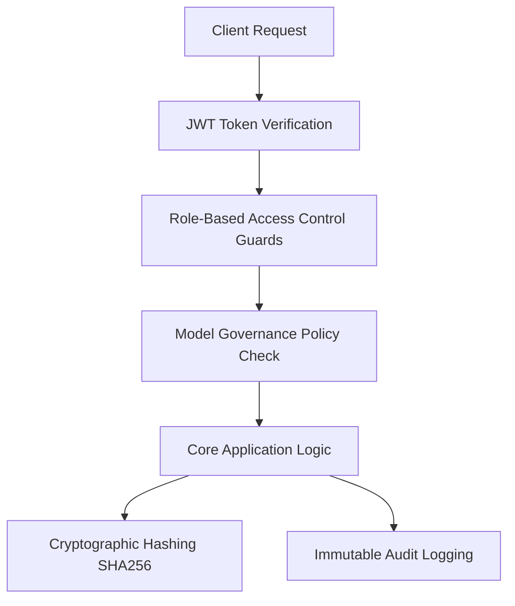

# SentinelX AI — Security Architecture & Policy Matrix

## Overview

SentinelX AI employs a defense-in-depth security architecture protecting application endpoints, machine learning models, database records, and generated forensic artifacts.

---

## 1. Security Controls Summary

---

## 2. Authentication & Credential Security

- **JWT Authentication**: Industry-standard JSON Web Tokens (`HS256` signature algorithm) with configurable expiration (`ACCESS_TOKEN_EXPIRE_MINUTES`).
- **Password Hashing**: Passwords stored as salted bcrypt hashes (`passlib[bcrypt]`). Raw passwords are never logged or stored.
- **Environment Isolation**: JWT secrets (`JWT_SECRET`) and database credentials are injected dynamically via environment variables, never hardcoded.

---

## 3. Role-Based Access Control (RBAC) Matrix

SentinelX AI enforces role-based endpoint authorization across five user roles:

| Resource / Action | Admin | Security Analyst | Analyst | User | Guest |
| :--- | :---: | :---: | :---: | :---: | :---: |
| **View Dashboard & Metrics** | ✅ | ✅ | ✅ | ✅ | ✅ |
| **Launch Attack Simulation** | ✅ | ✅ | ❌ | ❌ | ❌ |
| **Create & Triage Incident** | ✅ | ✅ | ✅ | ❌ | ❌ |
| **Train ML Model Experiment** | ✅ | ✅ | ❌ | ❌ | ❌ |
| **Promote / Rollback Model** | ✅ | ❌ | ❌ | ❌ | ❌ |
| **Generate SHAP Explanation** | ✅ | ✅ | ✅ | ✅ | ❌ |
| **Generate Incident PDF Report** | ✅ | ✅ | ✅ | ❌ | ❌ |
| **Download PDF & Verify Hash** | ✅ | ✅ | ✅ | ✅ | ❌ |
| **Manage Users & DB Settings** | ✅ | ❌ | ❌ | ❌ | ❌ |

---

## 4. Immutable Audit Logging (`AuditService`)

All sensitive actions emit an append-only audit record in `audit_logs`:
- **Captured Attributes**: `id`, `user_id`, `action`, `resource`, `resource_id`, `ip_address`, `status`, `details`, `timestamp`.
- **Key Audited Actions**:
  - `ATTACK_CREATED`, `DETECTION_TRIGGERED`
  - `PREDICTION_EXECUTED`, `EXPLANATION_GENERATED`
  - `MODEL_PROMOTED`, `MODEL_ROLLED_BACK`
  - `REPORT_GENERATED`, `REPORT_DOWNLOADED`, `REPORT_FAILED`

Audit logs cannot be updated or overwritten through application services.

---

## 5. Cryptographic File Integrity & Container Security

- **SHA256 PDF Verification**: Every report PDF has its 64-character SHA256 hex digest computed upon rendering. The `POST /api/v1/reports/{report_id}/verify` endpoint recomputes disk hashes to detect file tampering.
- **Container Isolation**: Backend and frontend containers execute under dedicated non-root accounts (`appuser` UID 10001, `nextjs` UID 1001).
